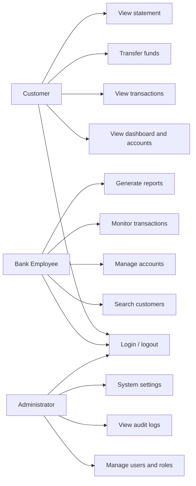
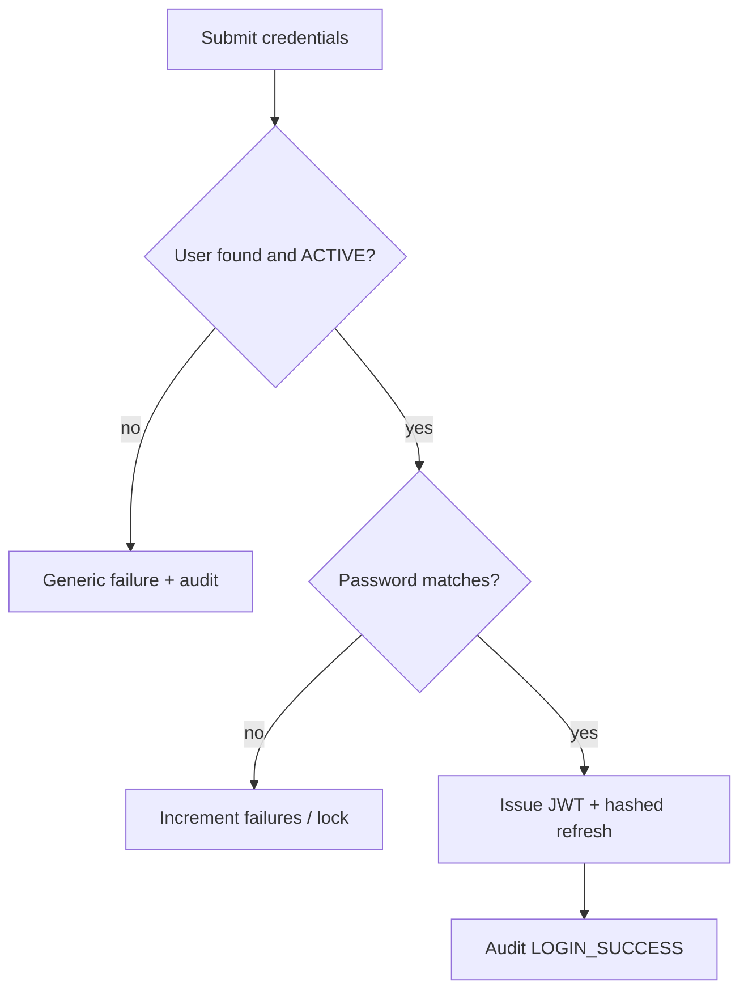
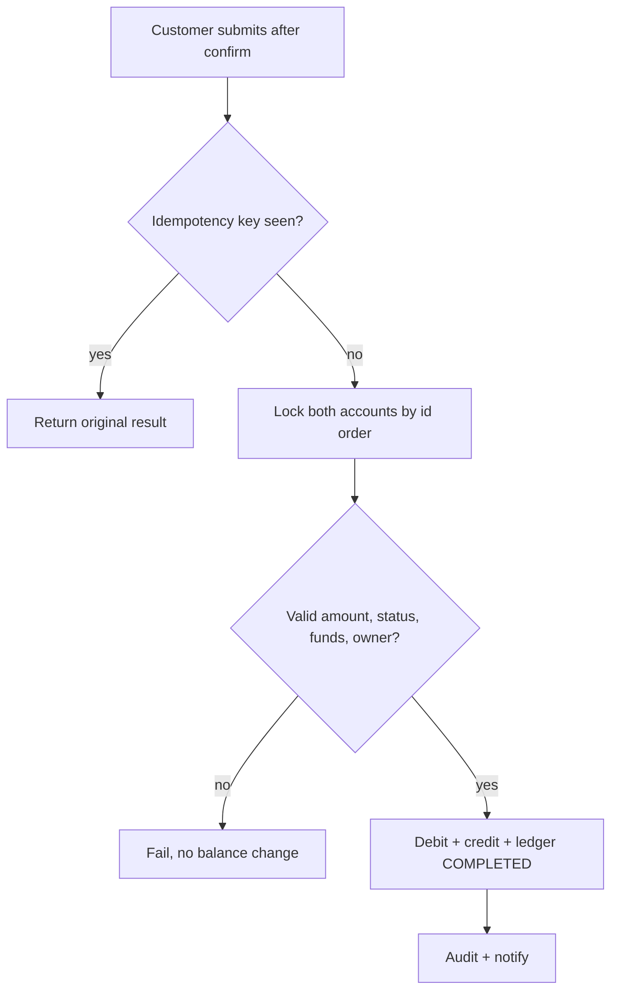
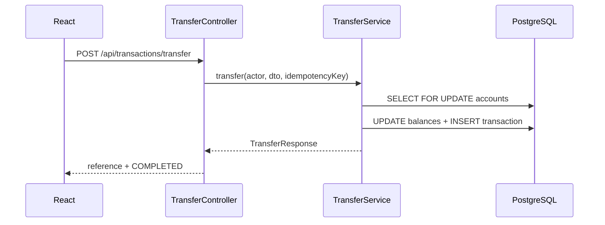
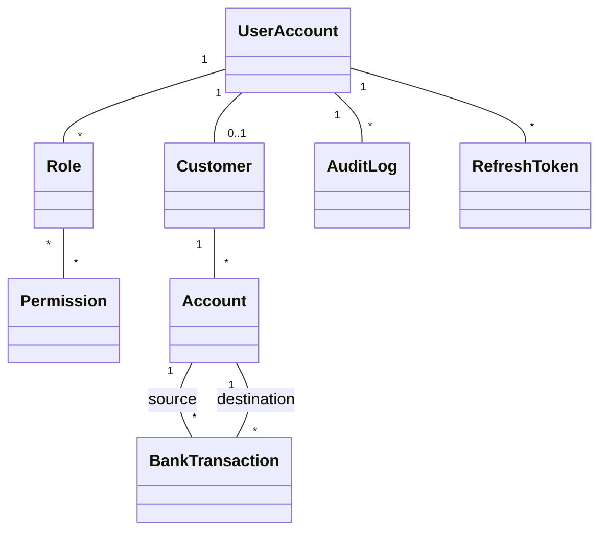

# UML and analysis (Phase 2)

Prototype: Secure Web-Based Banking Management System (DEMO / TEST).

## Use case diagram

## Activity: login

## Activity: fund transfer

## Sequence: transfer

## Class diagram (principal domain)

